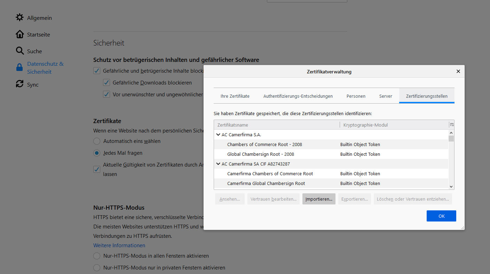
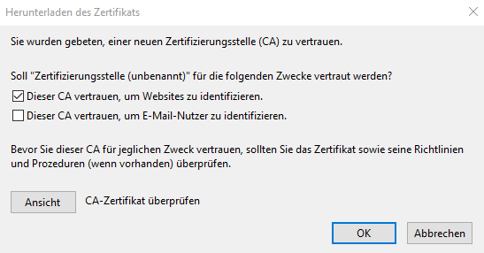

# Creating Certificates

## Usage

### import the certificate

To accept all certificates signed by the CA for this project and it's
demos the root certificate must be imported into the browser of your
choice.

If the Native App has been installed on the system, the root certificate
resides inside the program folder of the application
(`C:\Program Files (x86)\hda\nativeapp\*.crt`) otherwise it can be found
in `:demonstrations:/demoCA/rootCA.crt` - if found import it and accept
the option *Trust this CA to identify websites*.

Example how to import certificate in Firefox:

Importing the certificate in Firefox is done by following this menu
structure:
`Settings -> privacy and security -> certificates -> Certificate Manager -> Authorities -> import`

  

In the popup after clicking import
choose "Trust this CA to identify websites." and click OK.



Importing the root certificate has to be done for Thunderbird, too.

From a User perspective nothing more has to be done.

## Config & Development

### Why an own CA?

For our demos we need trusted certificates in order to have SSL/TLS
connections that are not flagged as *untrusted connection* by the
browser (because of server self-signed certificates). Having an own CA
where the root certificate is imported (and trusted) allows us to create
certificates as needed.

Currently we utilize certificates for: - Hosting `https` websites with
self specified domains - Sending signed mails - Hosting the teaching
platform

The following sections provide the basis for the usage of the CA for
creating new certificates or modification of already existing ones.

### generating rootCA

> This has already been done and remains for transparency reasons

1.  generate root key and certificate

``` bash
openssl genrsa -out rootCA.key 4096
openssl req -x509 -new -nodes -key rootCA.key -sha256 -days 1024 -out rootCA.crt
```

**! =\>** The `rootCA.crt` is used as root of trust and has to be
imported into the browser / thunderbird.

### Create new certificates (csr+sign)

In `demoCA` run
````
./sign_cert.py --domains <domain> --ca-cert intermediateCA.crt --ca-key intermediateCA.key
````

to generate a new certificate.

### Create a cert chain

Just concat the certs:
````
cat <your cert> intermediateCA.crt rootCA.crt > cert_chain.pem
````

### smime

To create smime signed mails you need a `key` and a `cert` signed by our
CA.

``` bash
# create the key
openssl genrsa -aes256 -out smime_nina_hardt.key 4096

# create csr - dont use the basic.cnf or your emailaddress will already be set
openssl req -new -key smime_nina_hardt.key -out smime_nina_hardt.csr -subj "/C=DE/ST=Hessen/L=Darmstadt/O=mpseinternational/CN=mpseinternational.com/emailAddress=nina.hardt@mpseinternational.com"

# sign the certificate
openssl x509 -req -days 2440 -in smime_nina_hardt.csr -CA intermediateCA.crt -CAkey intermediateCA.key -set_serial 1337 -out smime_nina_hardt.crt -addtrust emailProtection -addreject clientAuth -addreject serverAuth -trustout

# optional export key and cert for thunderbird import
openssl pkcs12 -export -in smime_nina_hardt.crt -inkey smime_user.key -out smime_nina_hardt.p12
```

### permissions

> The rootCA `key` should be restricted in access, in our environment
> not as critical.

Best practices: - directory 700 - owned by root - files 600 - owned by
root
