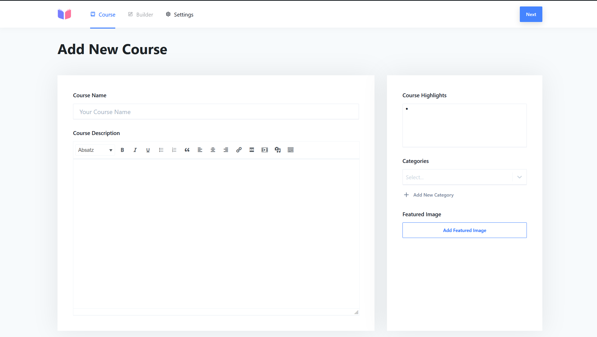
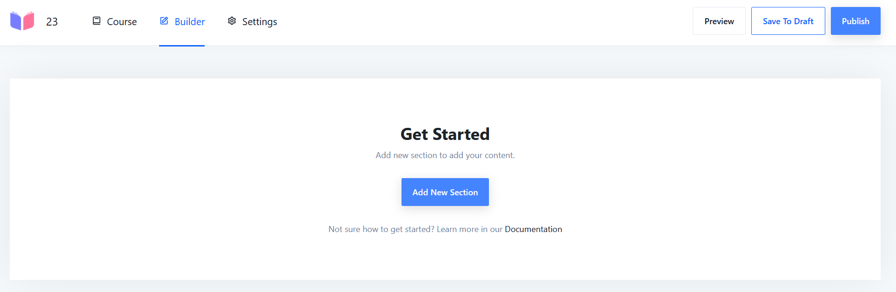

# Add Teaching Material to the Online Platform

## Tutor Account

| A Tutor (or Admin) Account is needed to add Teaching Material to the
  Platform.
| If there is no Account for a specific Organisation contact the
  adminstrator of the platform.

## Login on Platform

| The Tutor Account gives access to the Adminterminal of the Platform -
  Reachable in general under `yourdomain/wp-admin`
| For the Dev-ELITE-Platform the URL is
  <https://dev.elite.fbi.h-da.de/wp-admin/>

**Please only add and change content to/on the Dev-Platform.**

## Masteriyo

| On the Menu on the left side is a Tab for **Masteriyo**. Masteriyo is
  the Plugin used to create, modify and display courses on the Platform.
| After clicking on it on the Menu and beeing in the undercategory
  **Courses** (default when clicking on Masteriyo) of Masteriyo, a new
  course can be created.

### Add new Course

#### Course-Site

At the first creating page this Information can be inserted:

| **Course Name** should be related to the Demo it is refering to.
| **Course Description** should be a short (2-4 sentences) description
  about what the course is about.
| **Course Highlights** - not beeing used right now.
| **Categories** - not beeing used right now.
| **Featured Image** - not beeing used right now.
| **Slug** becomes availible after publishing. Should use the same ID
  than the Demo it refers to.

<figure>

<figcaption>Course-Site</figcaption>
</figure>

When everything is filled in, the **Next** button on the top right side
will bring up the **Builder** Site.

#### Builder-Site

With the Button **Add new Section** multiple **Section** can be created.

<figure>

<figcaption>Builder-Site</figcaption>
</figure>

| After creating a Section, **Content** can be added to the Section.
| One Section can have multiple Content Parts.

| Sections can be dragged and dropped to change the Order.
| Content can be dragged and dropped to change the Order.

#### Settings-Site

No changes needed.

### Add Slug

| After publishing a Course, the **Slug** of that Course can be edited
  on the Course-Site.
| The Slug should be the ID of the Demo it refers to.
| So the course can be opened directly from the Demo window.
